# Plot Gallery

OpenRetailScience provides a comprehensive set of plotting functions designed specifically for retail analytics. All plots
use a consistent API and come pre-styled with retail-friendly color schemes and professional styling.

## Plot Types

<!-- markdownlint-disable MD033 -->

<section class="orsg-cat">

  <h2 class="orsg-cat__title">Trends over time</h2>
  How metrics move across a continuous period.

  <a class="orsg-card" href="plots/area/">
    
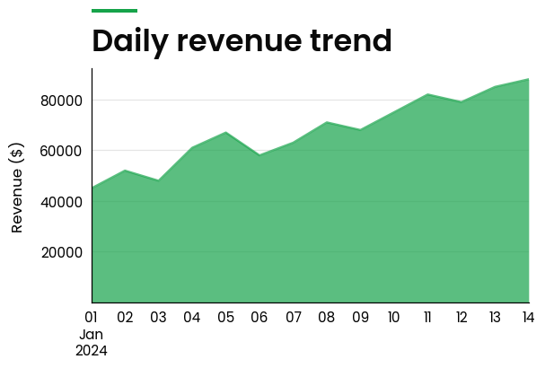

    

      <h3 class="orsg-card__title">Area Plot</h3>
      
Cumulative trends and volume over time

    

  </a>
  <a class="orsg-card" href="plots/line/">
    
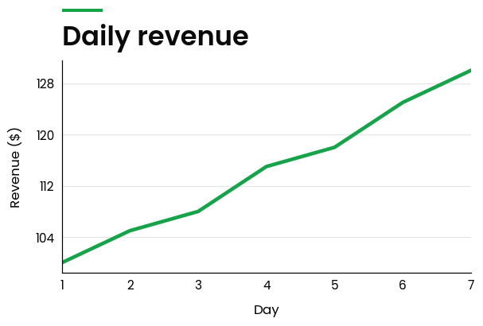

    

      <h3 class="orsg-card__title">Line Plot</h3>
      
Track a metric across a continuous period

    

  </a>
  <a class="orsg-card" href="plots/time/">
    
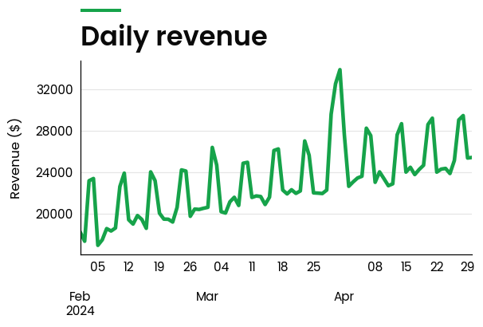

    

      <h3 class="orsg-card__title">Time Plot</h3>
      
Time series with smart date handling

    

  </a>
  <a class="orsg-card" href="plots/period_on_period/">
    
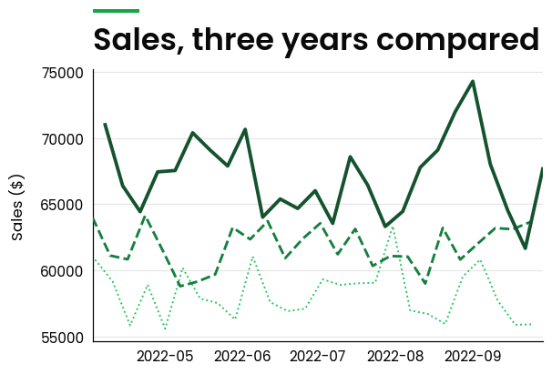

    

      <h3 class="orsg-card__title">Period on Period Plot</h3>
      
Compare the same period across years

    

  </a>
  <a class="orsg-card" href="plots/broken_timeline/">
    
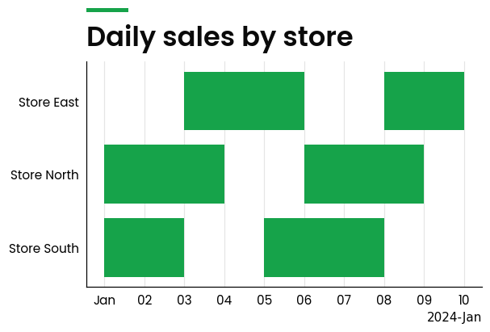

    

      <h3 class="orsg-card__title">Broken Timeline Plot</h3>
      
Spot gaps in product or store activity

    

  </a>

</section>

<section class="orsg-cat">

  <h2 class="orsg-cat__title">Comparison &amp; composition</h2>
  Rank categories and break totals into their parts.

  <a class="orsg-card" href="plots/bar/">
    
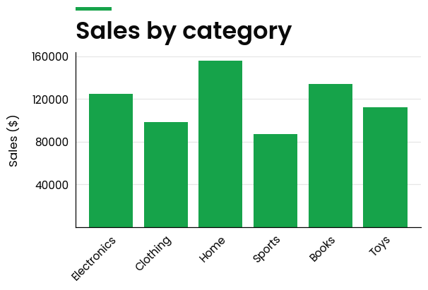

    

      <h3 class="orsg-card__title">Bar Plot</h3>
      
Compare values across categories

    

  </a>
  <a class="orsg-card" href="plots/index_plot/">
    
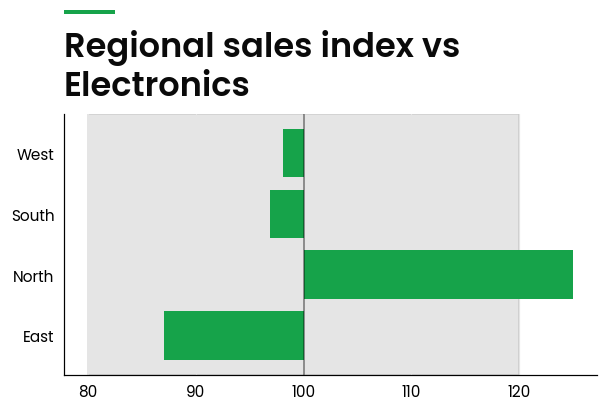

    

      <h3 class="orsg-card__title">Index Plot</h3>
      
Benchmark performance against an index

    

  </a>
  <a class="orsg-card" href="plots/waterfall/">
    
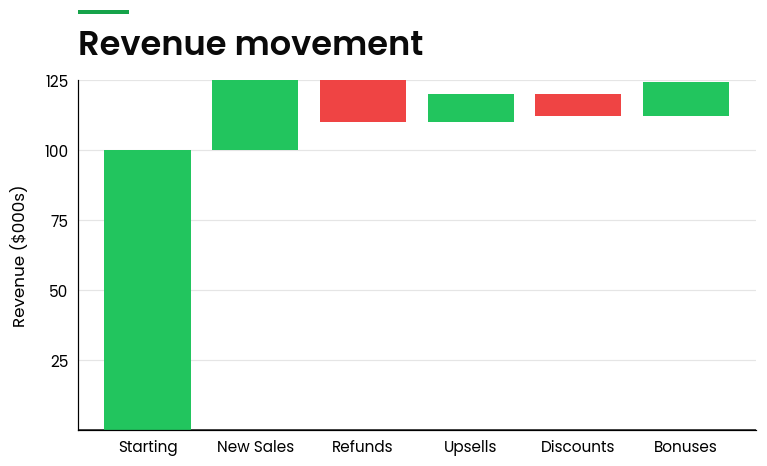

    

      <h3 class="orsg-card__title">Waterfall Plot</h3>
      
Break a total into its contributing parts

    

  </a>

</section>

<section class="orsg-cat">

  <h2 class="orsg-cat__title">Distribution &amp; relationships</h2>
  Understand spread, shape and correlation.

  <a class="orsg-card" href="plots/histogram/">
    
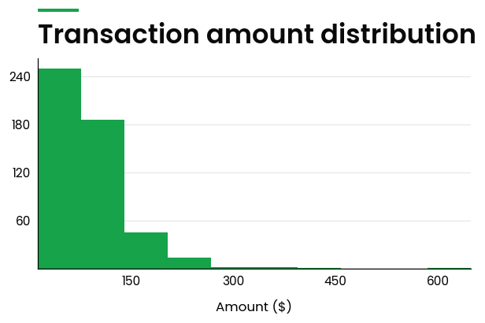

    

      <h3 class="orsg-card__title">Histogram Plot</h3>
      
See how a single measure is distributed

    

  </a>
  <a class="orsg-card" href="plots/scatter/">
    
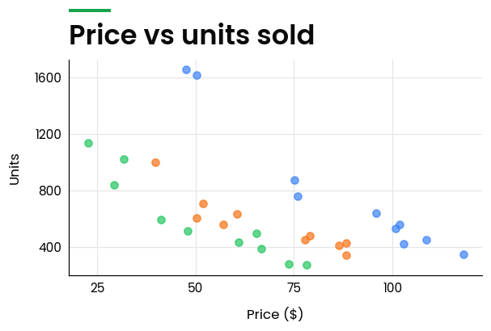

    

      <h3 class="orsg-card__title">Scatter Plot</h3>
      
Reveal relationships between two measures

    

  </a>
  <a class="orsg-card" href="plots/heatmap/">
    
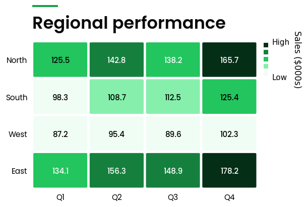

    

      <h3 class="orsg-card__title">Heatmap Plot</h3>
      
Spot patterns across a two-way matrix

    

  </a>
  <a class="orsg-card" href="plots/price/">
    
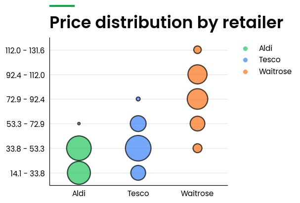

    

      <h3 class="orsg-card__title">Price Plot</h3>
      
Compare price distributions across retailers

    

  </a>

</section>

<section class="orsg-cat">

  <h2 class="orsg-cat__title">Customer &amp; retail analytics</h2>
  Purpose-built views for retail decisions.

  <a class="orsg-card" href="plots/cohort/">
    
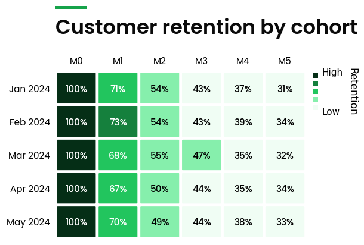

    

      <h3 class="orsg-card__title">Cohort Plot</h3>
      
Track retention by customer cohort

    

  </a>
  <a class="orsg-card" href="plots/customer_decision_hierarchy/">
    
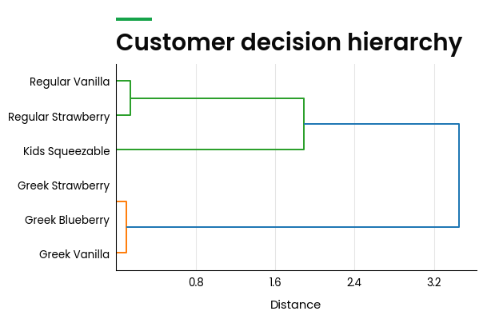

    

      <h3 class="orsg-card__title">Customer Decision Hierarchy</h3>
      
Map how shoppers substitute products

    

  </a>
  <a class="orsg-card" href="plots/revenue_tree/">
    
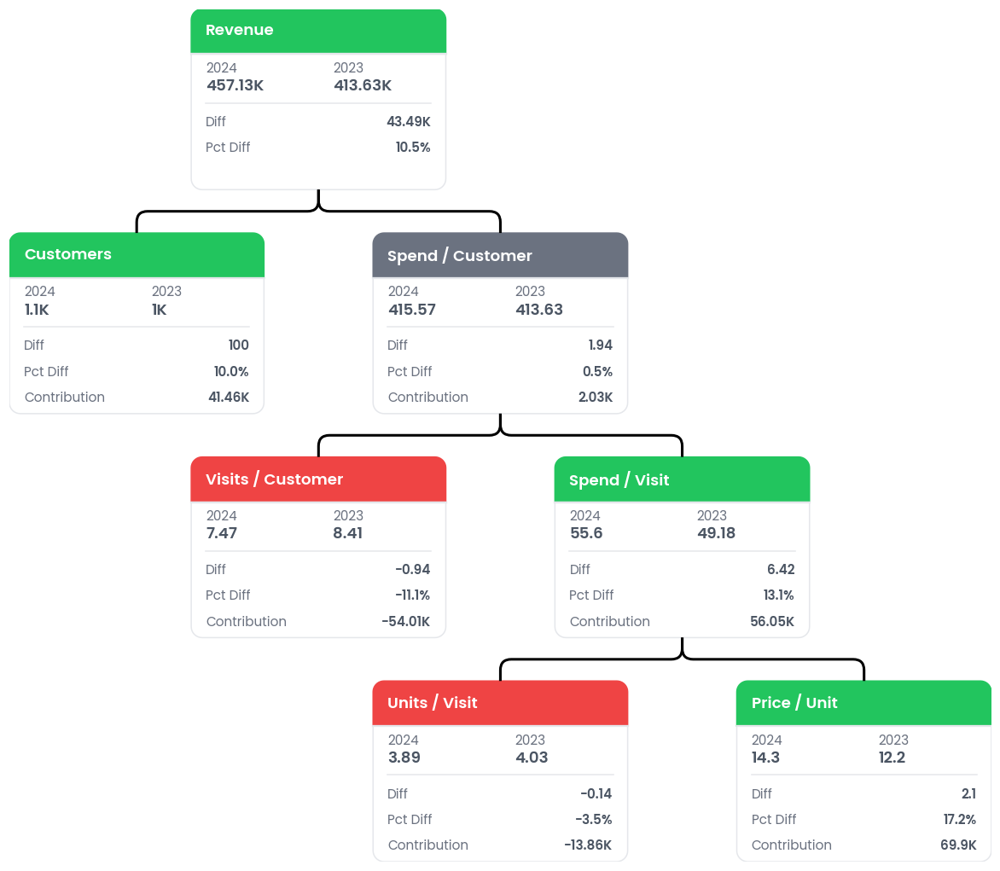

    

      <h3 class="orsg-card__title">Revenue Tree</h3>
      
Decompose revenue into its drivers

    

  </a>
  <a class="orsg-card" href="plots/venn/">
    
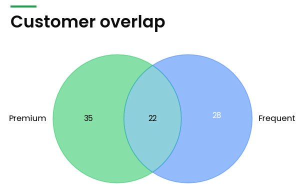

    

      <h3 class="orsg-card__title">Venn Diagram</h3>
      
Measure overlap between customer groups

    

  </a>

</section>
